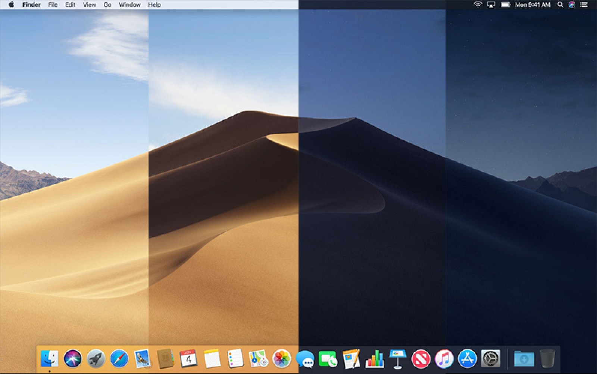

# Mojave GTK+ dynamic background
Recreates macOS Mojave dynamic background for GTK+ based GUIs, primarily made and tested on Ubuntu 18.06.



`mojave.xml` file used in my script is based on [trongthanh's mojave.xml](https://gist.github.com/trongthanh/7d632e90687e1bc219e1f3262d337702), few things are corrected in my fork.

## How to run
``` 
$ wget https://raw.githubusercontent.com/thelcrysis/Mojave-GTK-dynamic-background/master/setup.sh
$ bash setup.sh
```
_Script will ask you for your password for dependencies installation._

## Dependencies
* gsettings
* wget
* unzip
